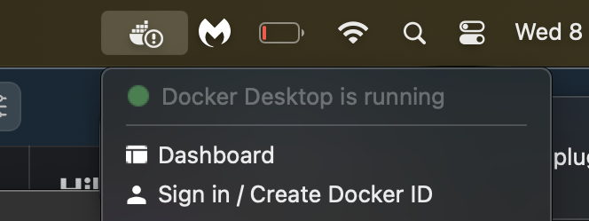

# Docker for dummies

:bulb: Con el objetivo de resolver el problema de Valgrind en computadoras no-linux. Les dejo una solución con Docker.

Según la [documentación oficial](https://docs.docker.com/get-started/overview/):

> Docker es una plataforma abierta para desarrollar, enviar y ejecutar aplicaciones. Docker le *permite separar sus aplicaciones de su infraestructura para que pueda entregar software rápidamente*. Con Docker, puede administrar su infraestructura de la misma manera que administra sus aplicaciones. Al aprovechar las metodologías de Docker para enviar, probar e implementar el código rápidamente, puede reducir significativamente la demora entre escribir el código y ejecutarlo en producción.


Básicamente docker va a proveernos de la infraestructura que nosotros definamos, sin problemas de versiones o dependedencias. En nuestro caso, **va a proveernos de una versión linux** sin importar donde lo estemos corriendo. 

¿Cómo logra esto? Es muy interesante estudiarlo pero por ahora "un hechizero lo hizo". Igual la [documentación oficial](https://docs.docker.com/get-started/overview/) de Docker es muy clara e interesante. 

Para instalar docker, deben seguir los pasos de la [documentación oficial](https://docs.docker.com/get-docker/).

En Mac lo van a ver como un programa comun y corriente en Applications. Para usarlo desde la consola tienen que abrirlo, como abririan cualquier programa. Pueden validar que tienen docker corriendo en su computadora en la barra de estado: 




Una vez docker está instalado, necesitan copiar en la carpeta root de su proyecto el archivo Dockerfile.

Docker funciona con imágenes y containers. Con el dockerfile van a definir una imagen que luego correrá en un container. 

**¿Cómo construir una imagen?**

Para construir una imagen deben hacer lo siguiente: 

```bash
docker build --tag testing-docker .
```

**¿Cómo correr una imagen en un container?**

```bash
docker run testing-docker
```

Para entender un poco lo que está pasando y puedan usar docker a su favor, es importante entender los comandos del Dockerfile: 

```Docker
# Esto se ejecuta cuando buildeamos la imagen
# Indica la imagen base que queremos usar, en este caso Docker. 
FROM ubuntu:22.10
# Instalamos gcc, valgrind y make 
RUN apt update -y && apt upgrade -y
RUN apt install gcc valgrind make -y
# Copiamos todo lo que está en el proyecto
COPY . /

# Esto es lo que se ejecutará cuando corramos la imagen
CMD make

```

> :warning: El primer build puede tomar mucho tiempo pero luego, algunos pasos se catchean (como instalar linux) y anda super rápido. 


