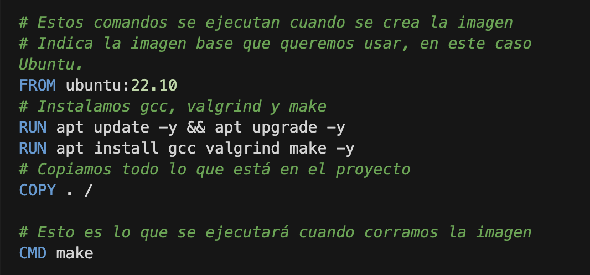

Docker for dummies
---

- [¿Qué es docker?](#qué-es-docker)
- [¿Cómo instalar Docker?](#cómo-instalar-docker)
- [¿Como se usa Docker?](#como-se-usa-docker)
  - [¿Cómo construir una imagen?](#cómo-construir-una-imagen)
  - [¿Cómo correr una imagen en un container?](#cómo-correr-una-imagen-en-un-container)
- [Docker y MacOS](#docker-y-macos)
- [Ejemplo TP1](#ejemplo-tp1)


# ¿Qué es docker?
:bulb: Con el objetivo de resolver el problema de Valgrind en computadoras no-linux, les dejo una solución con Docker.

Según la [documentación oficial](https://docs.docker.com/get-started/overview/):

> Docker es una plataforma abierta para desarrollar, enviar y ejecutar aplicaciones. Docker le *permite separar sus aplicaciones de su infraestructura para que pueda entregar software rápidamente*. Con Docker, puede administrar su infraestructura de la misma manera que administra sus aplicaciones. Al aprovechar las metodologías de Docker para enviar, probar e implementar el código rápidamente, puede reducir significativamente la demora entre escribir el código y ejecutarlo en producción.

Básicamente docker va a proveernos de la infraestructura que nosotros definamos, sin problemas de versiones o dependedencias. En nuestro caso, **va a proveernos de una versión linux** sin importar donde lo estemos corriendo. 

¿Cómo logra esto? Es muy interesante estudiarlo pero por ahora "un hechizero lo hizo". Igual la [documentación oficial](https://docs.docker.com/get-started/overview/) de Docker es muy clara e interesante. 

# ¿Cómo instalar Docker?

Para instalar docker, deben seguir los pasos de la [documentación oficial](https://docs.docker.com/get-docker/)

Una vez docker está instalado, necesitan copiar en la carpeta root de su proyecto el archivo Dockerfile.

# ¿Como se usa Docker?

Docker funciona con imágenes y containers. Con el dockerfile van a definir una imagen que luego correrá en un container.  Entonces, primero debemos crear la imagen y luego ejecutar un container usando esa imagen.

## ¿Cómo construir una imagen?

Para construir una imagen deben hacer lo siguiente: 

```bash
docker build --tag testing-docker .
```

## ¿Cómo correr una imagen en un container?

```bash
docker run testing-docker
```

Para entender un poco lo que está pasando y puedan usar docker a su favor, es importante entender los comandos del Dockerfile: 
<!-- 
```Docker
# Estos comandos se ejecutan cuando se crea la imagen
# Indica la imagen base que queremos usar, en este caso Ubuntu. 
FROM ubuntu:22.10
# Instalamos gcc, valgrind y make 
RUN apt update -y && apt upgrade -y
RUN apt install gcc valgrind make -y
# Copiamos todo lo que está en el proyecto
COPY . /

# Esto es lo que se ejecutará cuando corramos la imagen
CMD make

``` -->



> :warning: El primer build puede tomar mucho tiempo pero luego, algunos pasos se catchean (como instalar linux) y anda super rápido. 

> :exclamation: Recuerden hacer un build antes de un run!!!

# Docker y MacOS

En Mac lo van a ver como un programa común y corriente en Applications. Para usarlo desde la consola tienen que abrirlo previamente para ejecutar el Docker desktop. Esto lo hacen abriendo la aplicación como abririan cualquier otra. 
Pueden validar que tienen docker corriendo en su computadora en la barra de estado: 


Validado que el docker desktop esté corriendo pueden usar los comandos de la consola sin problemas. 
# Ejemplo TP1 

Les dejo un video de cómo use el docker file de este repo en el TP1 y corrí el programa usando docker. 

:eyes: [Link al video](https://drive.google.com/file/d/15Zt4MXd5km53dSl2bRHlrZ5MerYB0wNq/view?usp=share_link)

:eyes: [Ejemplo con el tp resuelto y las pruebas andando](https://drive.google.com/file/d/1tcAq8kxiDeU0w-__ZcQOYVgvBGvf6bZF/view?usp=share_link)